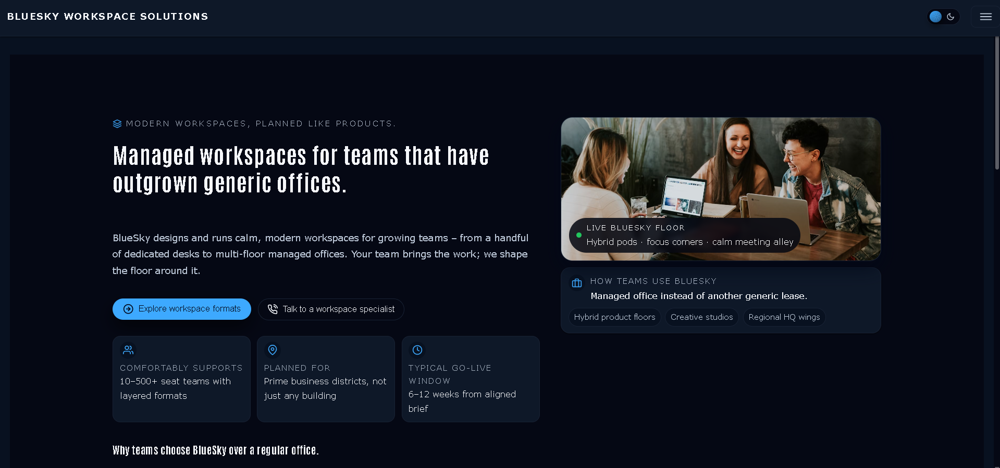
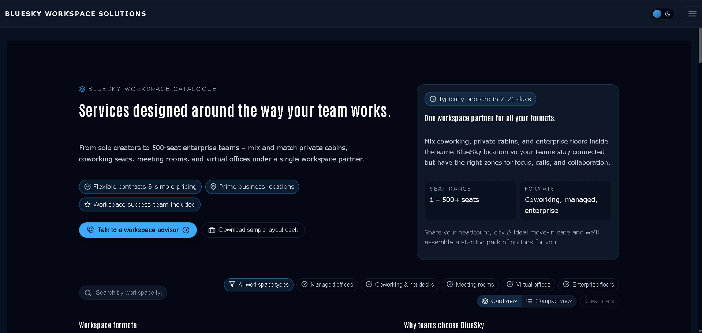
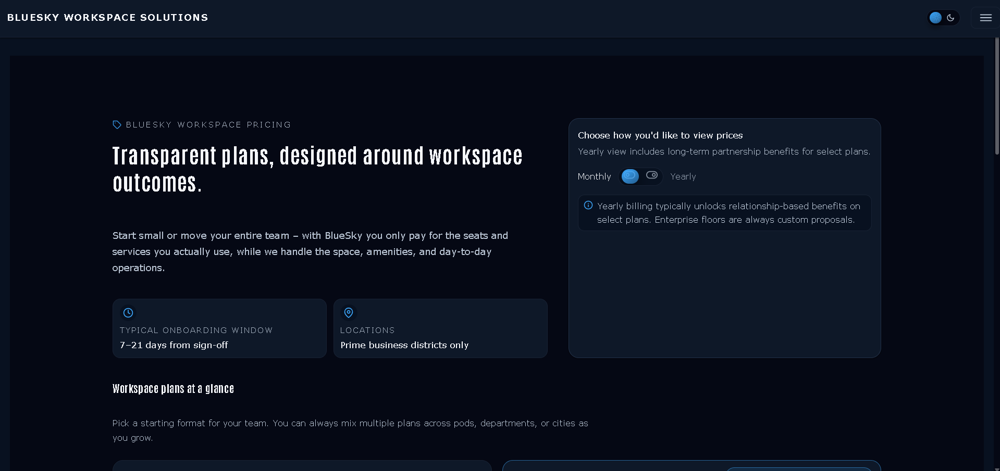
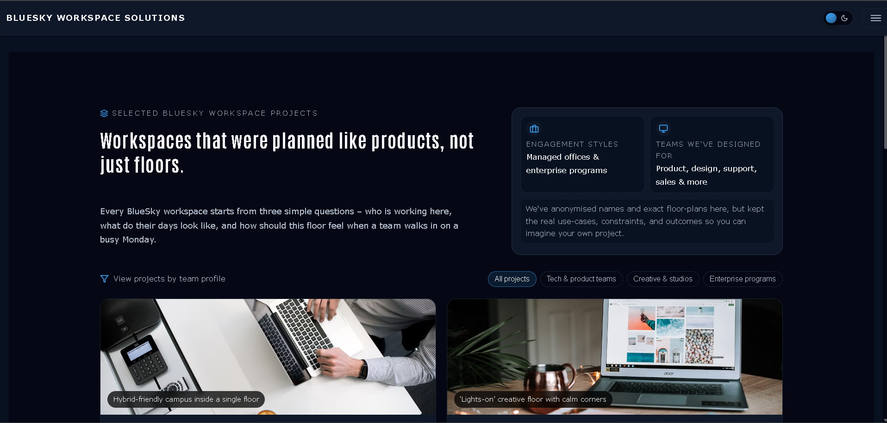
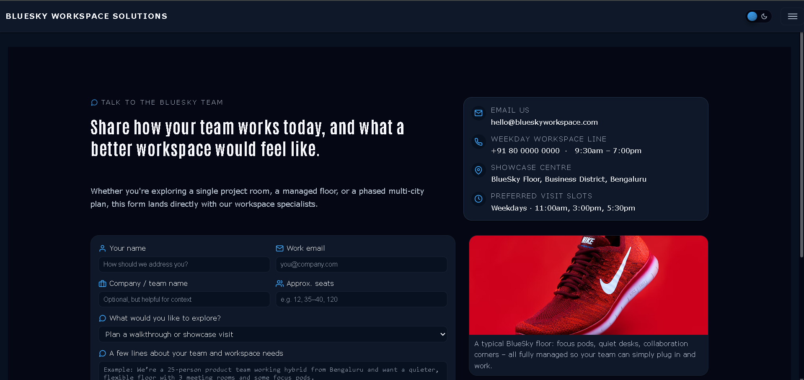

# BlueSky Workspace Solutions – Modern Office Workspace Website











A calm, premium brochure website for **BlueSky Workspace Solutions**,
showcasing modern office workspace formats, services, pricing, and real-world project stories.  
Built with a dark–light theme, clean typography, and simple navigation for teams exploring managed workspaces.

---

## 🌐 Live Demo

Live site (GitHub Pages):

**https://a2rp.github.io/bluesky-workspace**

---

## 📦 Repository

GitHub repo:

**https://github.com/a2rp/bluesky-workspace**

To clone this project:

```bash
# Clone the repository
git clone https://github.com/a2rp/bluesky-workspace.git
cd bluesky-workspace

# Install dependencies
npm install

# Start the dev server
npm run dev

# Open the URL shown in the terminal (usually):
http://localhost:5173
```
