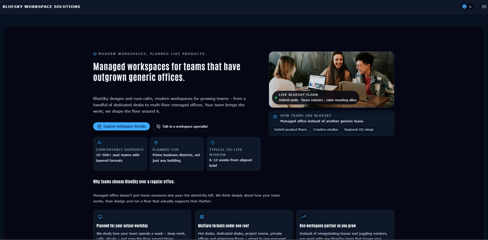

# BlueSky Workspace Solutions

A polished React and Vite brochure website for managed offices, flexible workspaces, and team-focused workplace planning.




## Features

- Responsive workspace-focused landing pages
- Services, pricing, projects, and contact routes
- Lazy-loaded routes with pathname-aware loading state
- Light and dark themes with saved preference
- Mobile drawer navigation
- GitHub Pages deployment

## Run locally

```bash
npm install
npm run dev
```

Build with `npm run build` and deploy with `npm run deploy`.

## Links

- Live: https://a2rp.github.io/bluesky-workspace/
- Repository: https://github.com/a2rp/bluesky-workspace
- Portfolio: https://www.ashishranjan.net/
- GitHub: https://github.com/a2rp
- CodePen: https://codepen.io/ash1198
- LinkedIn: https://www.linkedin.com/in/aashishranjan
- Facebook: https://www.facebook.com/theash.ashish/
- YouTube: https://www.youtube.com/@ashishranjan-ashz?sub_confirmation=1
- Email: mailto:ash.ranjan09@gmail.com

## Support

- Support: https://a2rp-donation-page.netlify.app/
- Buy Me a Coffee: https://buymeacoffee.com/a2rp
- Patreon: https://www.patreon.com/a2rp
